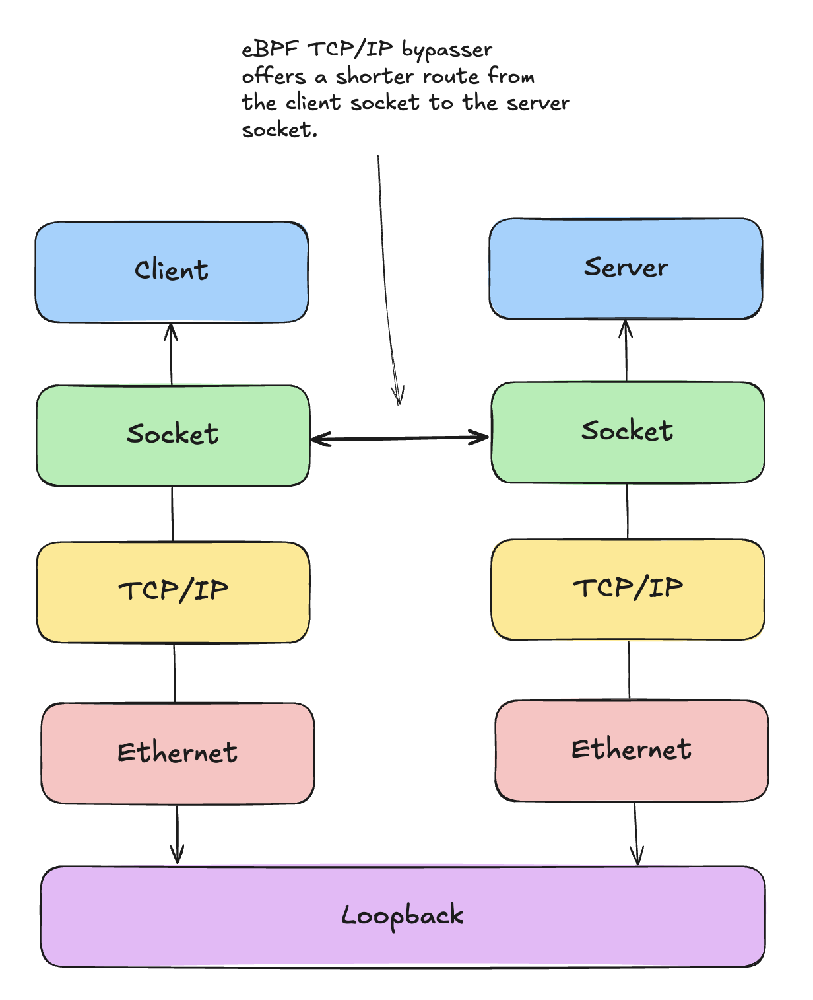

# Compile libbpf

```
git submodule update --init --remote --recursive
cd external/libbpf
OBJDIR=build DESTDIR=install-dir make -C src install
```

# Bypassing the TCP/IP stack for local connections

Instead of using the loopback interface to forward packets from one local socket
to another, we can use eBPF to redirect packets to the destination socket before
they traverse the TCP/IP stack in the kernel, and gain a slight performance
benefit.



First, compile the tcp-bypasser by running `make` in the `/tcp-bypasser`
directory. Then, you can run an experiment with:

```
sudo ./evaluate/test-bypasser.sh
```

This experiment establishes a connection between a client and a server, and then
sends 250,000 requests (1024 bytes) from the client and receives an echoed response
from the server. The average round trip time is then calculated as the sum of
the time it took to send/receive each request and response, divided by the
number of requests (250,000). It repeats the experiment after loading in the
eBPF program.

I'm running the experiment on a virtual machine running Ubuntu 24.10 (ARM) and
get the following results:

```
Average RTT (without bypasser): 42.721052 microseconds
Average RTT (with bypasser): 39.326267 microseconds
```

Which means roughly an 8% decrease in latency with the bypasser